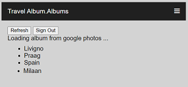
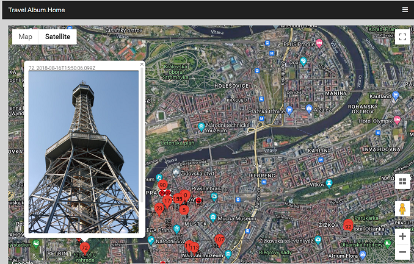

# Tralbum

Create a Travel Album by merging Google Photo albums and Locations history

```
Project discontinued: Google Timeline also includes photos
https://timeline.google.com/maps/timeline?pb=!1m2!1m1!1s2022-12-30
```

Select your album



Show album on Google Maps



## Steps to create your albums

- Create a Google Project https://console.cloud.google.com/
    - add OAuth 2.0 Client ID
    - add API key
    - add library:
        - photoslibrary.readonly
        - drive.readonly
    - save credentials in  bin/client_secret.json
- Takeout your google location history:
    - https://takeout.google.com/settings/takeout to get your location history
    - exctract your location history (default /Takeout/Location History/Semantic Location History)
- Run [bin/album_2geo.py](bin/album_2geo.py) with your album name (Case Sensitive)
    - this will find the closed datetime of location.timelineObjects and add it into your album photos
    - Creates the file: geo_album_name.json
        - with geo: {latE7, lngE7} added into your photo mediaItems
        - and timelineObjects extracted from your location history between the dates of your oldes / newest photo
    - Creates your geo_albums.json with a list of all extracted albums

- upload the json files geo_albums.json and geo_album_name.json to your Google Drive
- run http://localhost:xxxx/tralbum.html
    - List your albums (loads geo_albums.json) from Google Drive and 
    - Select an album (loads geo_albums_name.json from google Drive
        - loads photos from your google photo album
    - Show your travel with photos on google Maps
        - click to show photos
